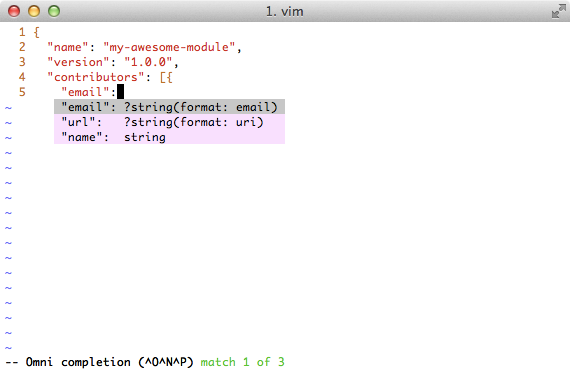
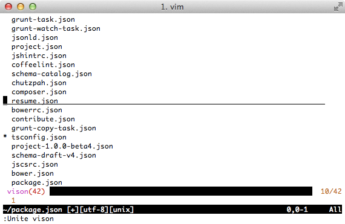

# vison [](https://travis-ci.org/Quramy/vison)

Vison is a Vim plugin to help writing `*.json` file with [JSON Schema](http://json-schema.org/).

Vison provides the following features:

* Completion keys or values in JSON files
 * You can use more than 40 schema files provided [JSON Schema Store](http://schemastore.org/json/).
* Manegement JSON schema files.



## How to install

Vison requires the following:

* git command

And, installation of the following Vim plugin is recommended:

* [Shougo/unite.vim](https://github.com/Shougo/unite.vim)

If you use [NeoBundle](https://github.com/Shougo/neobundle.vim) for Vim plugins management, append the following to your `.vimrc`:

```vim
NeoBundle 'Shougo/unite.vim'
NeoBundle 'Quramy/vison'
```

And exec `:NeoBundleInstall`.

After installation, **execute `:VisonSetup` command**.
So, vison fetches schema file from [JSON Schema Store](http://schemastore.org/json/).
You don't need exec this command at the next Vim launch.

## Usage

### Apply schema with command
To use omni-completion, you can call the `:Vison` command on the current buffer.

For example, start editing with `vim package.json` (NPM configuration file) and call `:Vison package.json`

If your current buffer's basename is equal to the schema name, you can ommit the argument of this command.

Once a schema file is applied, you can complete keys or values in the current buffer with omni-completion(type `<Ctrl-x><Ctrl-o>`).

You can also configure your `.vimrc` for auto applying schema with `autocmd`.
For example:

```vim
autocmd BufRead,BufNewFile package.json Vison
autocmd BufRead,BufNewFile .bowerrc Vison bowerrc.json
```

### Apply schema with Unite
If you have installed [Unite](https://github.com/Shougo/unite.vim), you can get a list of stored schema using `:Unite vison`.

And select a candidate, the selected schema apply to the current buffer.



### Register schema files
Open some JSON schema file in Vim and exec `:VisonRegisterSchema`.
Then, the schema file is registered into the vison.

By the default, the schema file is copied into the `~/.cache/vison/default` directory.

This command regards the basename of the current buffer as the schema name.
If the basename is `package.json` then the schema name is also `package.json`.

To set schema name explicitly, call this command with the argument.

For example `:VisonRegisterSchema npm-package`.

### Customize completion
You can configure completion with the `completeopt` option.

If you don't want the popup menu:

```vim
autocmd FileType json setlocal completeopt-=menu
```

If you want to show more informations in the preview window when completion:

```vim
autocmd FileType json setlocal completeopt+=menu,preview
```

### Customize schema store
*T.B.D.*

### More details
If you want more details, please see [doc/vison.txt](doc/vison.txt).

## License
MIT
